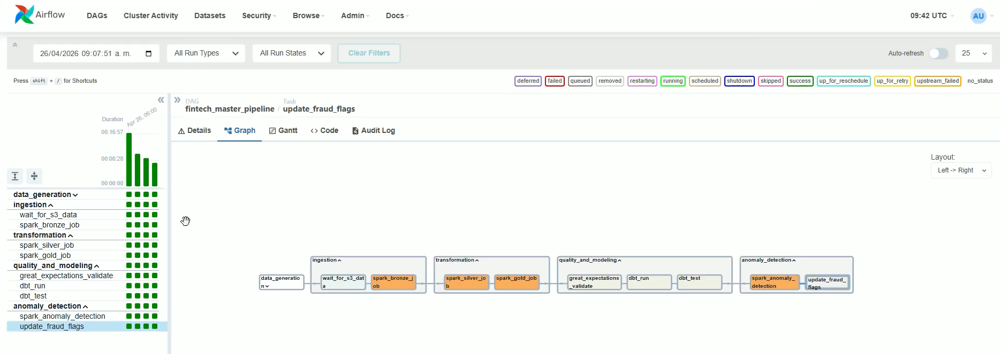
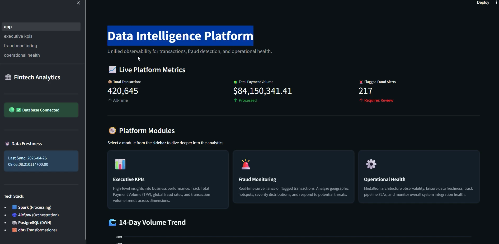
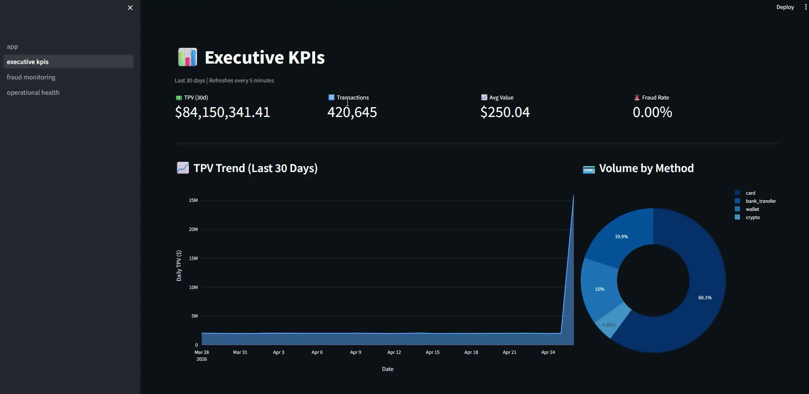
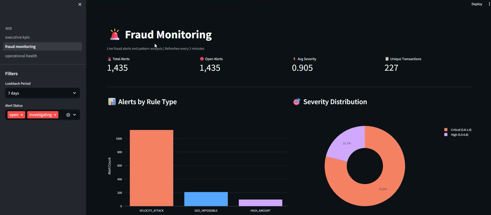
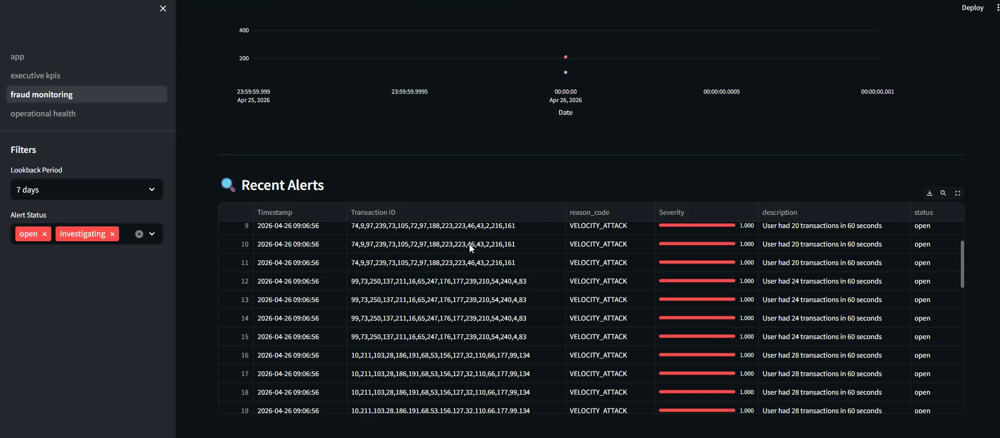
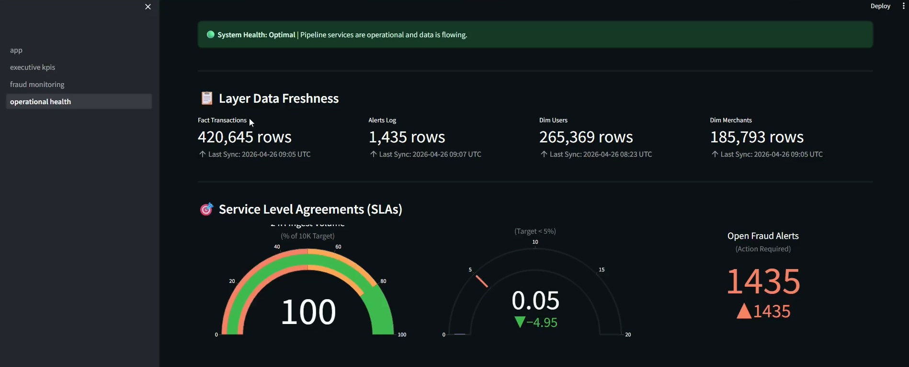

# 🏦 Fintech Data Intelligence Platform

> Plataforma End-to-End de Ingeniería de Datos con detección de fraude, Arquitectura de Capas (Medallion) y analítica en tiempo real.

[](https://python.org)
[](https://spark.apache.org)
[](https://airflow.apache.org)
[](https://getdbt.com)
[](https://postgresql.org)

---

### 📸 Project Demo

| | | |
|:---:|:---:|:---:|
|  |  |  |
| **Airflow** | **Dashboard** | **Dashboard** |
|  |  |  |
| **Dashboard** | **Dashboard** | **Dashboard** |

---

## 📖 ¿Qué problema resuelve este proyecto?

En el sector financiero y Fintech moderno, las empresas procesan miles de transacciones por minuto. Esto genera desafíos críticos:
1. **Escalabilidad y Formato:** Procesar grandes volúmenes de datos crudos (JSON) y transformarlos en formatos analíticos estructurados sin que los sistemas colapsen.
2. **Detección de Fraude en Tiempo Real:** Identificar comportamientos sospechosos (ataques de velocidad, montos inusuales, imposibilidad geográfica) casi al instante.
3. **Privacidad y Seguridad:** Proteger la Información Personal Identificable (PII) cumpliendo con regulaciones estrictas.
4. **Inteligencia de Negocio (BI):** Entregar KPIs confiables a directivos para la toma de decisiones.

**Nuestra Solución:** Un ecosistema de datos contenerizado (11 servicios) orquestado con Airflow, que procesa transacciones con Spark bajo la Arquitectura Medallion, modela datos en PostgreSQL usando dbt, evalúa fraude mediante Machine Learning (Isolation Forest) y expone resultados en un dashboard interactivo de Streamlit.

---

## 🏗️ Arquitectura por Capas (Layered Architecture)

El proyecto sigue estrictamente las mejores prácticas de separación de responsabilidades:

### 1. Data Generation Layer (`data_generator/`)
- Simula un entorno real de transacciones (10K txns/min).
- Inyecta patrones complejos de fraude (2% de los datos) de forma aleatoria para probar el sistema.

### 2. Infrastructure Layer (`infrastructure/`)
- Define la infraestructura como código (IaC) usando **Terraform**.
- Despliega **LocalStack** para simular los buckets de Amazon S3 localmente de forma gratuita y reproducible.

### 3. Ingestion & Processing Layer (`processing/` - Medallion Architecture)
Utiliza **Apache Spark** para procesamiento masivo distribuido:
- **🥉 Bronze Layer:** Ingesta los JSONL crudos hacia un formato columnar inmutable (Parquet).
- **🥈 Silver Layer:** Limpia, valida datos (vía Great Expectations), elimina duplicados y aplica hashing criptográfico (SHA-256) a los datos sensibles (PII).
- **🥇 Gold Layer:** Agrega los datos estructurados y los inserta en las tablas Staging de PostgreSQL.

### 4. Storage & Modeling Layer (`warehouse/`)
- Utiliza **PostgreSQL** como el motor de Data Warehouse.
- Transforma los datos Staging a un Modelo de Estrella (Kimball Star Schema) usando **dbt (Data Build Tool)**.
- Administra dimensiones de cambio lento (SCD Type 2) para retener el historial completo de los usuarios.

### 5. Orchestration Layer (`orchestration/`)
- Usa **Apache Airflow** con `CeleryExecutor` y `Redis` para programar (`@hourly`) y vigilar la ejecución secuencial de todo el pipeline.

### 6. Presentation / BI Layer (`analytics/`)
- **Streamlit** genera un Dashboard interactivo con 3 paneles clave: Executive KPIs, Fraud Monitoring, y Operational Health.

### 7. Observability & Monitoring Layer (`monitoring/`)
- **Prometheus** recolecta métricas de estado de Airflow, Spark y PostgreSQL.
- **Grafana** provee paneles visuales en tiempo real para observar cuellos de botella e incidentes técnicos.

---

## 🚀 Inicio Rápido (Quick Start)

Levantar este clúster complejo toma solo unos pasos gracias a Docker Compose y el uso de `Makefile`:

```bash
# 1. Clona el repositorio
git clone <repo-url> && cd Fintech

# 2. Configura los secretos (las plantillas seguras están listas)
cp .env.example .env

# 3. Construye y levanta toda la infraestructura (~10 min la primera vez)
make up

# 4. Genera los datos sintéticos iniciales
make generate

# 5. Entra a Airflow y ejecuta el pipeline
# Visita http://localhost:8080 (user: admin / pass: admin)
# Enciende el DAG "fintech_master_pipeline"
```

---

## 🔐 Seguridad y Buenas Prácticas (GitHub Ready)

Este repositorio ha sido ordenado y verificado para un despliegue seguro en repositorios públicos:
- **Cero Credenciales Expuestas:** Todos los tokens, usuarios y contraseñas usan variables de entorno. El archivo `.env` real está protegido por el `.gitignore`.
- **Plantilla Segura:** Se provee un archivo `.env.example` transparente con valores *placeholder* (`CHANGE_ME_BEFORE_USE`).
- **Protección PII:** La IP de las transacciones (y otra data sensible) es hasheada irreversiblemente en la capa Silver. La capa Gold analítica *nunca* tiene acceso a la información cruda del cliente.
- **Principio de Menor Privilegio:** Los contenedores corren con usuarios no-root (`fintech:1000`) y Airflow tiene RBAC habilitado.
- **Directorio Limpio:** Los logs de testeo (`logs/`), cachés de python (`__pycache__`), y estados locales de Terraform están ignorados para mantener el repositorio limpio y ordenado.

---

## 📈 ¿Cómo Escalar este Proyecto?

Este sistema es un simulador local, pero está construido con arquitectura *Production-Ready*:
- **Procesamiento:** El código Spark está listo para ejecutarse en Amazon EMR, Databricks o Kubernetes (GKE/EKS) para procesar Terabytes de información (solo requiere cambiar el endpoint `SPARK_MASTER_URL`).
- **Almacenamiento:** Terraform provisiona en LocalStack; con tan solo modificar la variable `AWS_REGION` y proveer credenciales reales, el sistema guardará la información en un bucket S3 infinito real.
- **Data Warehouse:** PostgreSQL aguanta cargas masivas locales. Para petabytes, los modelos de `dbt` pueden apuntar a motores en la nube como **Snowflake** o **Google BigQuery** con adaptaciones mínimas de los conectores.

---

## 📚 Referencia de Servicios Locales

| Servicio | URL Local | Credenciales por Defecto |
|----------|-----------|--------------------------|
| **Airflow UI** | [http://localhost:8080](http://localhost:8080) | `admin` / `admin` |
| **Dashboard Streamlit** | [http://localhost:8501](http://localhost:8501) | — |
| **Spark Master UI** | [http://localhost:8081](http://localhost:8081) | — |
| **Grafana** | [http://localhost:3000](http://localhost:3000) | `admin` / *Ver variable en `.env`* |
| **Prometheus** | [http://localhost:9090](http://localhost:9090) | — |

Para más detalles operativos, consulta la carpeta `docs/`, especialmente el [`MANUAL_USUARIO.md`](docs/MANUAL_USUARIO.md) y el [`ARCHITECTURE.md`](docs/ARCHITECTURE.md).
